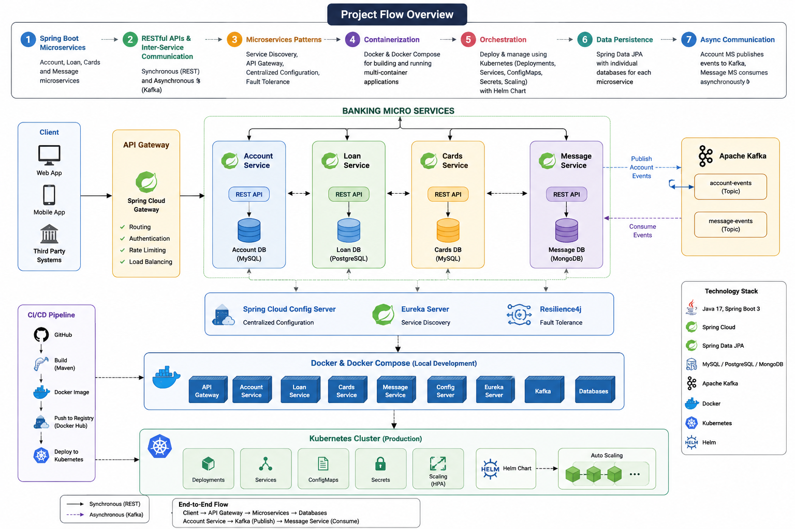

# 🏦 Banking Microservices System

A cloud-native banking application built using **Spring Boot**, **Spring Cloud**, **Docker**, **Kubernetes**, and **Apache Kafka** following modern microservices architecture principles.

This project was developed as part of the Udemy course:

> **Master Microservices with Spring Boot, Docker, Kubernetes By Madan Reddy**

---

# 📌 Project Overview

The application consists of multiple independently deployable microservices that communicate through both synchronous REST APIs and asynchronous event-driven messaging.

The project demonstrates how to build scalable, resilient, and cloud-native backend applications using the Spring ecosystem.

---

# 🏗️ Architecture



---

# 🚀 Microservices

| Service | Description |
|----------|-------------|
| Account Service | Manages customer accounts |
| Loan Service | Manages customer loans |
| Cards Service | Manages customer cards |
| Message Service | Processes asynchronous events from Kafka |
| API Gateway | Entry point for all client requests |
| Eureka Server | Service Discovery |
| Config Server | Centralized Configuration |

---

# ⚙️ Tech Stack

### Backend

- Java 17
- Spring Boot
- Spring Cloud
- Spring Data JPA
- Spring Security (if used)
- Maven

### Databases
- PostgreSQL
- H2 im memory database

### Cloud & DevOps

- Docker
- Docker Compose
- Kubernetes
- Helm
- ConfigMaps
- Secrets

### Messaging

- Apache Kafka
- rebitMQ

### Microservices Patterns

- API Gateway
- Service Discovery
- Centralized Configuration
- Fault Tolerance (Resilience4j)
- Distributed Configuration

---

# ✨ Features

- RESTful APIs
- Microservices Architecture
- Independent Databases
- Service Discovery
- API Gateway Routing
- Centralized Configuration
- Dockerized Services
- Kubernetes Deployment
- Helm Charts
- Event-Driven Communication
- Horizontal Scaling
- Fault Tolerance

---

# 🔄 Application Flow

## Synchronous Communication

```text
Client
    │
    ▼
API Gateway
    │
    ▼
Account Service
    │
    ├────────► Loan Service
    │
    └────────► Cards Service
```

---

## Asynchronous Communication

```text
Account Service
        │
 Publish Account Event
        │
        ▼
   Apache Kafka
        │
 Consume Event
        ▼
Message Service
        │
Send Notification / Email / SMS
```

---

# 🐳 Docker

Every microservice is containerized using Docker.

Docker Compose is used for local development to run:

- API Gateway
- Eureka Server
- Config Server
- Kafka
- Databases
- All Microservices

using a single command.

```bash
docker-compose up -d
```

---

# ☸️ Kubernetes Deployment

The application is deployed on Kubernetes using Helm Charts.

Deployment includes:

- Deployments
- Services
- ConfigMaps
- Secrets
- Horizontal Pod Autoscaler
- Helm Release Management

---

# 📂 Project Structure

```
banking-microservices
│
├── api-gateway
├── account-service
├── loan-service
├── cards-service
├── message-service
├── config-server
├── eureka-server
├── docker-compose
├── kubernetes
├── helm
└── architecture.png
```

---

# 📨 Kafka Event Flow

```
Account Created
        │
        ▼
Account Service
        │
Publish Event
        │
        ▼
Kafka Topic
        │
        ▼
Message Service
        │
Process Notification
```

---

# 📚 What I Learned

- Designing cloud-native applications
- Building scalable microservices
- Spring Cloud ecosystem
- API Gateway
- Eureka Service Discovery
- Distributed Configuration
- Docker containerization
- Kubernetes orchestration
- Helm package management
- Apache Kafka messaging
- Event-driven architecture
- Spring Data JPA
- Resilience4j fault tolerance
- Cloud-native deployment best practices

---

# 🛠️ Future Improvements

- JWT Authentication
- Keycloak Integration
- Distributed Tracing (Zipkin)
- Prometheus Monitoring
- Grafana Dashboards
- ELK Stack Logging
- CI/CD with GitHub Actions
- AWS Deployment

---

# 👨‍💻 Author

**Mohamed Elgreatly**

LinkedIn:
https://www.linkedin.com/in/mohamed-elgreatly/


---

## ⭐ If you found this project interesting, feel free to visit instructor repo https://github.com/eazybytes/microservices !
